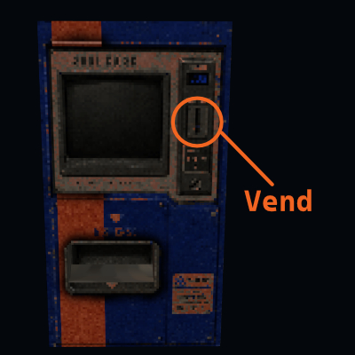
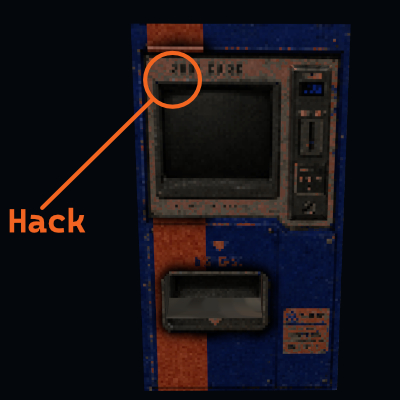
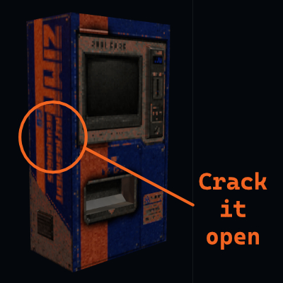
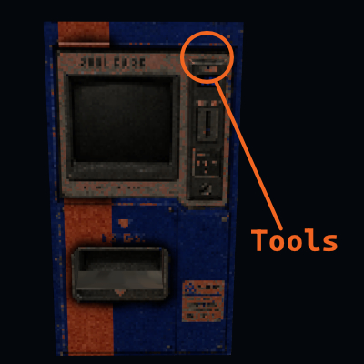
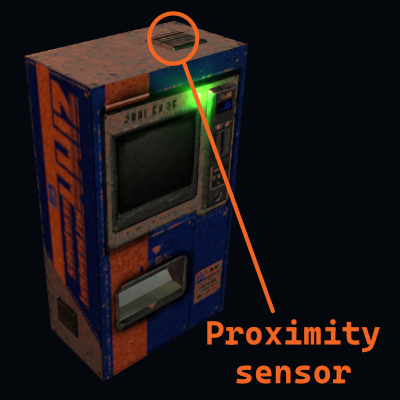

# ZimmCo Vending Unit — A Warden's Guide

A free, interactive 3D prop for **ZimmCo Refreshment Beverages**, a module for the [Mothership RPG](https://www.tuesdayknightgames.com). 

**For all machine information, get the module for FREE:** [ZimmCo Refreshment Beverages on itch.io](https://shanevincent.itch.io/zimmco-refreshment-beverages)

Point your players at a live vending machine, let them push the buttons themselves, and let the tool handle the rolls, the state, and the consequences.

**Vending machine prop:** https://101lizardman.github.io/zimmco/

---

## Functions:
I've used passwords below to gatekeep which functions your players can do- have they heard the rumor yet? The players can enter the passwords into the relevant tabs in order to gain access to that function.

| Function | Additional details | Where/How?
|---|---|---|
| **VEND** | Dispense a beverage (costs 25C each) |  |
| **HACK THE MAINFRAME** | Accessing the wiring behind the terminal exposes ports for hacking |  |
| **CRACK IT OPEN** | Smash the machine open, risking the stock inside |  |
| **TOOLS** | Unjam the lever to open the maintenance compartment. Associated rumor: *"In exchange for a pack of cigarettes, an old shipwright told you how to find the little lever tucked away behind the panel of the coin slot…"* |  |
| **PROXIMITY SENSOR** | Wire something into the machine's proxy sensor for use when the machine's in **LOCKDOWN**. Associated rumor: *"Junkers used to setup these bad boys as warning alarms for if any of the less community-minded individuals happened upon the same wreck…"* |  |
| **TERMINAL** | Access local networks after the machine has been **HACKED**. Associated rumor: *"After catching that kid trying to spoof your ID chip, you learn that she got access to it from the vending machine — why is it even on the network?"* | Password: `matrix` in the **HACKED** tab |
| **TRANSCEIVER** | Access the rudimentary transceiver buried within. Associated rumor: *"A clone mentioned they had escaped their creators by smashing apart a ZimmCo vending machine and finding some sort of communicator inside…"* | Password: `bananaPhone` in the **INTERNALS** tab  (after the machine has been opened) |
| **JUMP START** | Jump start a heart (or something). Associated rumor: *"Shorting the capacitor bank allows for a single, dangerous high voltage surge of power, but what's left behind is just a brick."* | password: `defib` in the **INTERNALS** tab (after the machine has been opened) |
| **SHELTER** | Climb inside the machine for your own, little capsule home... for as long as you have oxygen. Associated rumor: *"You'd heard this one a million times before — some Spacer in a tight spot wiggled their way inside the machine, sealed themselves in and drifted in space for weeks, but it simply can't be true… right?"* | password: `bunker` in the **INTERNALS** tab (after the machine has been opened). Requires **6+ Durability** and it must have been HACKED *and* OPENED |

---

## Finding a new machine
Done with your current machine and want to leave it behind? Simply refresh the page.

---

## Thanks & credits

- Vending machine 3D model by [ZwiebelGames](https://sketchfab.com/3d-models/kiosk-machine-retro-horror-vending-automat-300c0c705eea4c0f9d510021c847646f) on Sketchfab.
- Sound effects by [Kyodon](https://pixabay.com/sound-effects/film-special-effects-vending-machine-action-61196/) on Pixabay.
- Voice work by Blair Sist
